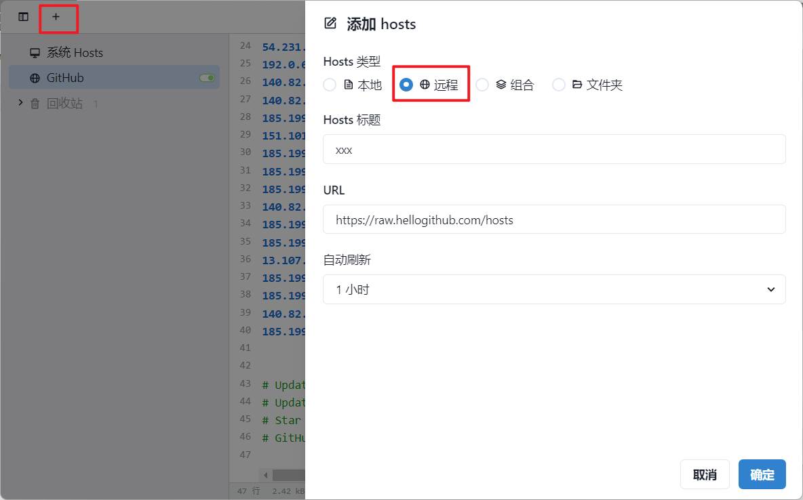

# Github加速访问

## 一、加速访问GitHub

### 手动方式：

首先通过下面的地址获取最新的hosts内容：

```url
#文件		https://raw.hellogithub.com/hosts
#JSON	 https://raw.hellogithub.com/hosts.json
```

Windows系统下载的hosts文件用记事本打开，会出现以下内容，数据是每天都会更新的，因此有所差别：

```
# GitHub520 Host Start
140.82.113.26                 alive.github.com
140.82.112.6                  api.github.com
185.199.110.153               assets-cdn.github.com
185.199.111.133               avatars.githubusercontent.com
185.199.111.133               avatars0.githubusercontent.com
185.199.111.133               avatars1.githubusercontent.com
185.199.108.133               avatars2.githubusercontent.com
185.199.108.133               avatars3.githubusercontent.com
185.199.111.133               avatars4.githubusercontent.com
185.199.108.133               avatars5.githubusercontent.com
185.199.111.133               camo.githubusercontent.com
140.82.113.22                 central.github.com
185.199.108.133               cloud.githubusercontent.com
140.82.112.10                 codeload.github.com
140.82.112.22                 collector.github.com
185.199.111.133               desktop.githubusercontent.com
185.199.108.133               favicons.githubusercontent.com
140.82.113.3                  gist.github.com
52.217.171.57                 github-cloud.s3.amazonaws.com
52.217.198.153                github-com.s3.amazonaws.com
52.217.106.52                 github-production-release-asset-2e65be.s3.amazonaws.com
52.217.198.153                github-production-repository-file-5c1aeb.s3.amazonaws.com
54.231.196.9                  github-production-user-asset-6210df.s3.amazonaws.com
192.0.66.2                    github.blog
140.82.112.4                  github.com
140.82.112.18                 github.community
185.199.109.154               github.githubassets.com
151.101.193.194               github.global.ssl.fastly.net
185.199.109.153               github.io
185.199.111.133               github.map.fastly.net
185.199.110.153               githubstatus.com
140.82.113.26                 live.github.com
185.199.111.133               media.githubusercontent.com
185.199.111.133               objects.githubusercontent.com
13.107.42.16                  pipelines.actions.githubusercontent.com
185.199.108.133               raw.githubusercontent.com
185.199.111.133               user-images.githubusercontent.com
140.82.113.21                 education.github.com
185.199.111.133               private-user-images.githubusercontent.com


# Update time: 2024-07-16T04:52:56+08:00
# Update url: https://raw.hellogithub.com/hosts
# Star me: https://github.com/521xueweihan/GitHub520
# GitHub520 Host End
```

复制上述内容，将其粘贴到系统的hosts文件内容末尾并保存，不同的系统hosts文件路径如下：

```
Windows 系统：C:\Windows\System32\drivers\etc\hosts
Linux 系统：/etc/hosts
Mac（苹果电脑）系统：/etc/hosts
Android（安卓）系统：/system/etc/hosts
iPhone（iOS）系统：/etc/hosts

注意：
Windows 使用记事本。
Linux、Mac 使用 Root 权限：sudo vi /etc/hosts。
iPhone、iPad 须越狱、Android 必须要 root。
```

到此为止大部分情况下是直接生效的，如未生效可以尝试刷新DNS：

```
Windows：在 CMD 窗口输入：ipconfig /flushdns
Linux 命令：sudo nscd restart，如报错则须安装：sudo apt install nscd 或 sudo /etc/init.d/nscd restart
Mac 命令：sudo killall -HUP mDNSResponder
```

如果还未生效，即打开GitHub依旧很慢，图片加载不出来，最后一招：重启。

### 自动方式

使用[SwitchHosts](https://github.com/oldj/SwitchHosts/releases)管理hosts，参考如下配置

```
Hosts 类型: Remote		远程！！
Hosts 标题: 随意
URL: https://raw.hellogithub.com/hosts
自动刷新: 最好选 1 小时

```



如此hosts一有更新就会自动去更新系统的hosts文件，免去了手动更新的麻烦。

### 没有写入Hosts权限

使用SwitchHosts添加配置时最可能遇到的问题便是对系统HOSTS没有写入权限，针对Windows系统，按着如下路径找到HOSTS文件

```
C:\Windows\System32\drivers\etc\hosts
```

在属性-->安全选项-->编辑，选中电脑的User，勾选允许修改和写入后保存，再执行SwitchHosts即可

## 二、科学上网

软件：[Clash](https://github.com/clash-verge-rev/clash-verge-rev/releases)、[V2rayNG](https://github.com/2dust/v2rayNG/releases)，二者均有对应的安卓版本
节点：[免费节点更新](https://clashnodev2ray.github.io/)